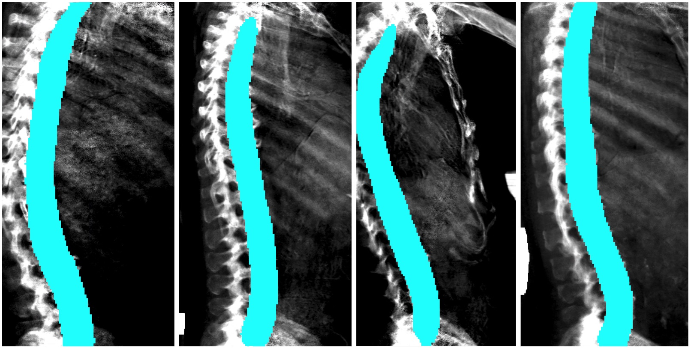
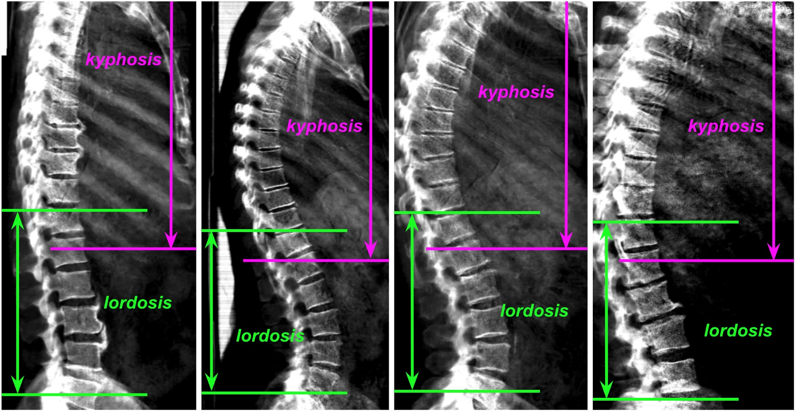
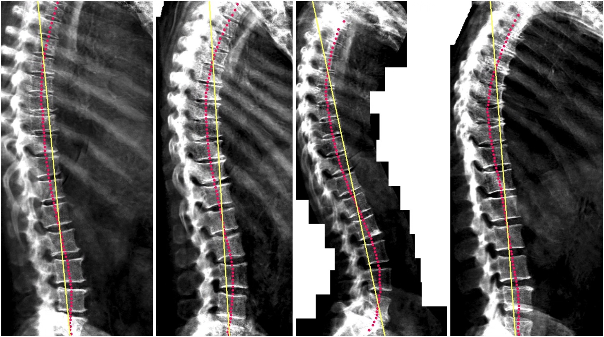
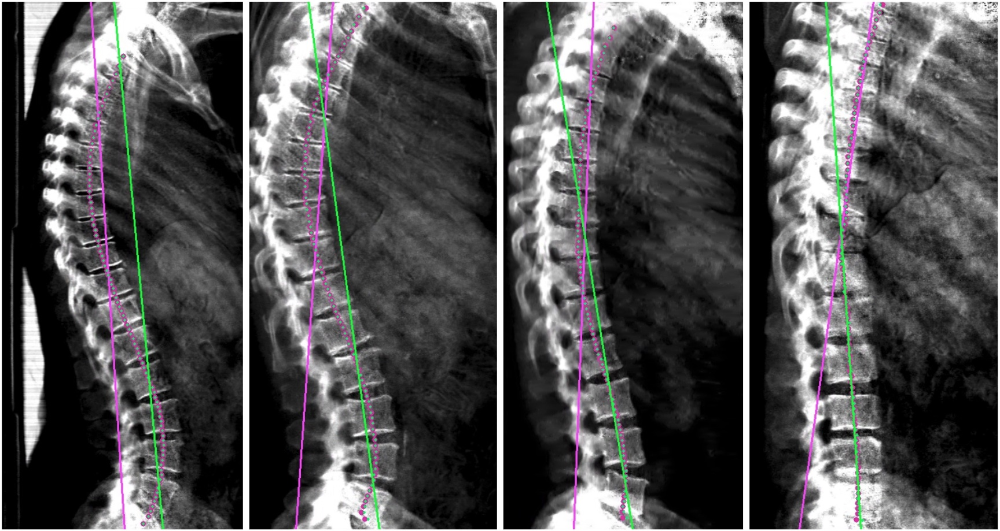
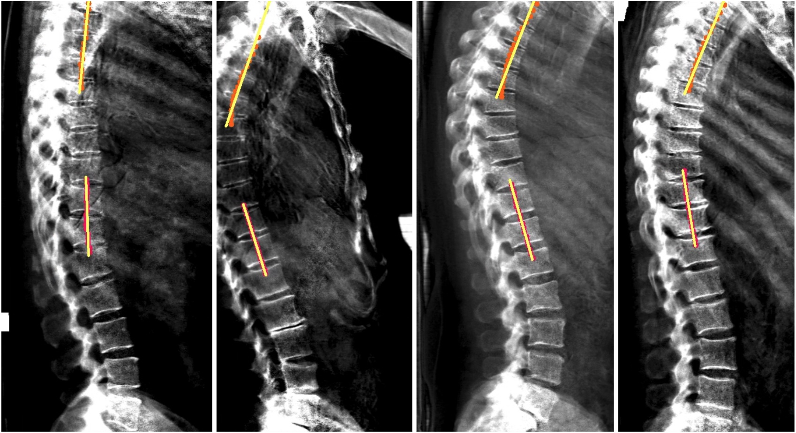
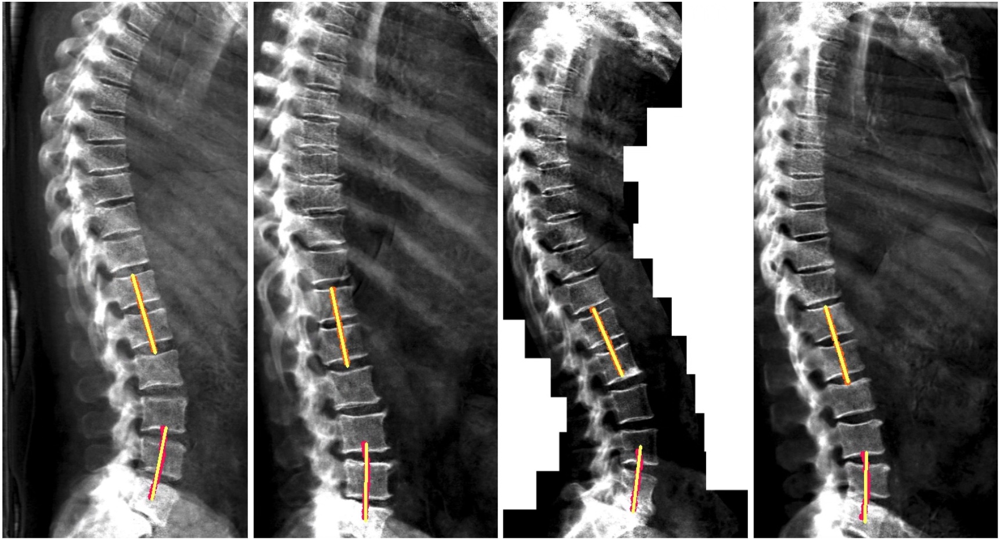
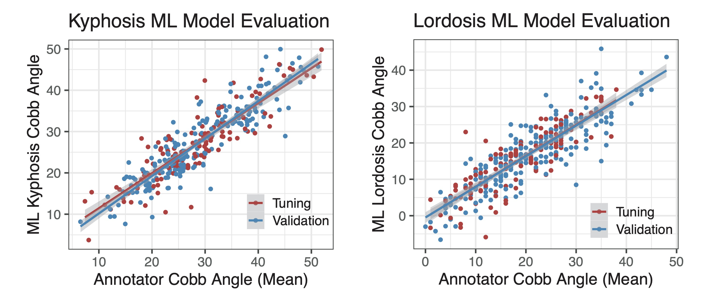

[Back to home.](../README.md)

# Kyphosis/Lordosis: Methods Description

The pipeline described here scores the extent of curvature either in the upper/thoracic
spine (kyphosis) or lower/lumbar spine (lordosis), using a
lateral dual-energy X-ray absorptiometry (DEXA) scan image of a human torso. The angular values that are measured
are supposed to estimate Cobb angles (Vrtovec et al, 2009), though in this pipeline they are measured
by a different mechanism.

The analysis occurs in four steps:
1. Determination of whether the DEXA image is left-facing or right-facing;
2. Segmentation of the body of the spine;
3. Identification of anterior intervertebral junctions;
4. Geometric estimation of the curvature of the spine in the designated region.

Details on each of those steps are given below, along with the final performance of the
system against hold-out test data generated by human annotators.

## Step 1: Determination of whether the DEXA image is left-facing or right-facing.

The sign of the observed angle for either kyphosis or lordosis depends on the orientation
of the image and a conventional (but geometrically arbitrary) decision about which direction
of rotation to define as positive.  For this application, <b>zero angle</b> is defined as a perfectly
straight spine, and <b>positive angles</b> are defined based on the typical curvature of the spine,
when facing forward: concave for kyphosis and convex for lordosis.

By default, this application uses an image classification model to determine whether an
image is left-facing or right-facing.  That model is a re-trained version of the [ResNet V2 50
model, originally trained for imagenet (ILSVRC-2012-CLS) classification](https://tfhub.dev/google/imagenet/resnet_v2_50/classification/1).
This model achieved 100% accuracy for correct sorting of 91 images from UKBioBank, each
presented as found in the UKBB (right-facing) or horizontally flipped (left-facing) - i.e. 182 test images.

Given the consistently right-facing orientation of side-angle DEXA scans in the UKBB,
a command flag was implemented to force analysis assuming all images to face in a
given direction, called as either `--side_facing right` or `--side_facing left`.

## Step 2: Segmentation of the body of the spine.

In order to trace the curvature of the spine, a semantic segmentation model was trained
to label the body of the spine.  The body of each vertebra was labelled, along with the
spaces in between.  This model was trained using the tool provided by the
[“image-segmentation-keras” code base](https://github.com/divamgupta/image-segmentation-keras)
(commit f04852d from September 6, 2019),
specifying the “vgg_unet” model architecture (Simonyan, 2014),
with input widths and heights of 192 and 384, respectively.  This model labelled
a manually-annoted test set of 59 images with a mean IoU accuracy of 0.889 (SD 0.021).

Diagram 1:

## Step 3: Identification of thoracic and lumbar regions.

### Step 3a: Identification of anterior intervertebral junctions.

In order to register the position along the spine, to determine the appropriate
portion of the spine along which to measure curvature, the anterior edge of each
intervertebral space is identified using an object detection model:

Diagram 2:

This model was trained for the [ML measurement of DISH](https://github.com/calico/DISH).  Its
performance and details of its training are described in that repo.  As for DISH, the 14 
top-scoring predicted boxes are used for downstream analysis.

### Step 3b: Definition of thoracic and lumbar regions using intervertebral junctions.

For both left-facing and right-facing images, it was always assumed that the image was
in an upright orientation (i.e. the person's shoulders were at the top and pelvis was
at the bottom of the image).  It was also assumed that each image was of the spine from
approximately the shoulders to the hips.  Therefore, for both kyphosis and lordosis,
curvature was measured from the cut-off point derived below all the way to the appropriate
edge of the image (top edge for kyphosis, bottom edge for lordosis).

The center points for each of the 14 intervertebral disc
boxes generated were calculated, then sorted along the y-axis,
from top to bottom.
The y-axis cut-off point was defined using the y-axis values
from that sorted list of coordinates.  For kyphosis, the cut-off
was set to halfway between the 11th and 12th (zero-indexed) y
coordinates from the list.  For lordosis, the cut-off
was set to 25% of the distance between the 10th and 11th y
coordinates from the list.

For kyphosis, the <i>region of interest</i> was defined as being
above the cut-off, i.e. all the way to the top of the image.
For lordosis, the <i>region of interest</i>
was defined as being below the cut-off, with a further
refinement that is described under *Step 4* - i.e. <i>almost</i>
all the way to the bottom of the image.

Diagram 3:

The borders of these regions can be modified with command-line arguments (see [Detailed Usage Instructions](docs/getstarted.md)).

## Step 4: Geometric estimation of the curvature of the spine in each designated region.

In order to define a consistent reference axis across images (the <i>spine axis</i>),
an orthogonal distance regression (ODR) was taken through the spine mask (shown below in yellow),
countingeach masked pixel as a data point. The mask pixel points were then sorted along that
axis.  A <i>spinal trace</i> was generated by dividing that sorted list of points into
90 bins.  For each bin, the average position of all points in the bin was taken, and
that value was added to the <i>spinal trace</i> (shown below in red).

Diagram 4:

At this point, for lordosis, the <i>region of interest</i> was refined at the bottom by excluding
the bottom-most 6% of data along the <i>spine axis</i>.

<b>Shown below:</b> for each analysis (kyphosis or lordosis), a new <i>spine axis</i> was
then calculated using ODR on the <i>spinal trace</i> points that fell within the <i>region of
interest</i>.  These new axes are shown below, in <b>pink for kyphosis</b> and in <b>green
for lordosis</b>.  The new axis was then used to re-compute the <i>spinal trace</i> using
the same procedure as above (and shown below as dots matching the colors of their
corresponding axis).  <b>Note</b> that the original implementation of this software did
not re-compute the trace.  Though it had negligable impact on the output, that original
behavior can be invoked using the `--legacy` flag.

Diagram 5:

In order to measure spinal curvature, spinal trace points whose positions
along the <i>spine axis</i> fell within the <i>region of interest</i>, and sorted
along that axis, were divided into three equally-sized sets.
ODR lines were taken for the <i>spinal trace</i>
points from the sets highest and lowest along the axis.  Below, the relevant points
are in red, and their derivative vectors are in yellow.

Shown for <b>kyphosis</b> (Diagram 6):

Shown for <b>lordosis</b> (Diagram 7):

The angle difference
between those two lines was reported as the Cobb angle estimate, with sign adjusted
as described above.

## Final performance evaluation.

Theh ML-based estimation algorithms for both kyphosis and lordosis performed well on a 200-image validation dataset, closely matching the results of human annotators with high correlation values (r=0.872 and r=0.862 for the kyphosis and lordosis, respectively, versus the validation set).  This was when run with the following command-line options: `--aug_flip --side_facing right` for kyphosis; `--aug_flip --side_facing right --aug_tilt 0.5` for lordosis. See [Detailed Usage Instructions](docs/getstarted.md) for explainations of those options.

## References

Simonyan  K, Zisserman  A. (2014) Very deep convolutional networks for large-scale image recognition. <i>arXiv preprint arXiv:1409.1556</i>. doi:[10.48550/arXiv.1409.1556](https://arxiv.org/abs/1409.1556)

Vrtovec T, Pernus F & Likar B. (2009) A review of methods for quantitative evaluation of spinal curvature. <i>Eur. Spine J.</i> 18:593–607. [PMID: 19247697](https://pubmed.ncbi.nlm.nih.gov/19247697/)
