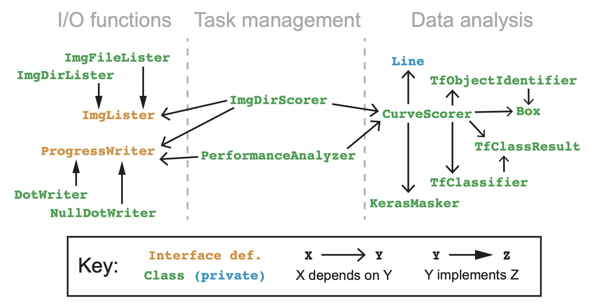
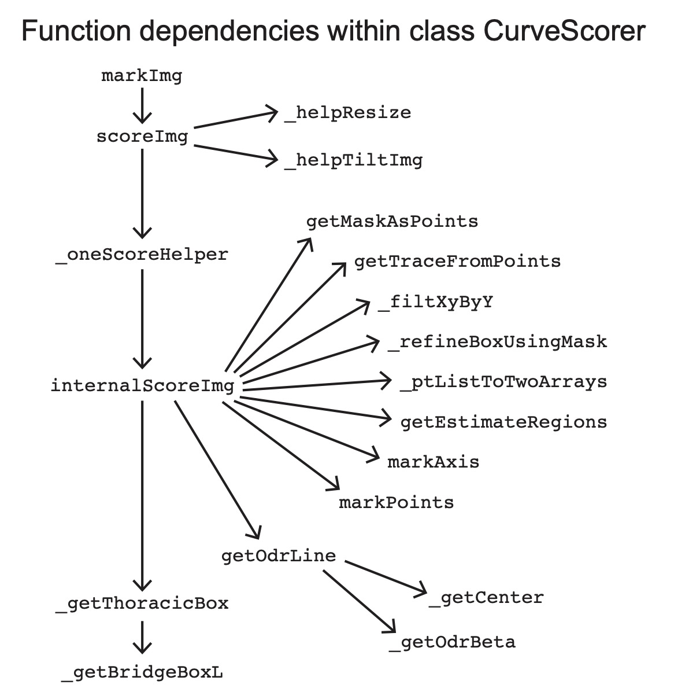

[Back to home.](../README.md)

# Developer Documentation

This application borrows design and implementation from the application
that I developed for the [ML measurement of DISH](https://github.com/calico/DISH),
and re-uses one of the ML models (see [Methods Description](analysis.md)).

## Module Organization

This system is implemented using a data-centric abstraction model.  There 
is a set of classes responsible for the analysis of data,
a set of classes responsible for input & output of progress and data,
and a pair of classes responsible for managing the overall workflow.  The following
classes are implemented, with the indicated dependencies on one another:

### Data analysis:

**CurveScorer** executes the scoring of kyphosis & lordosis in supplied DEXA images.
It applies ML models using stored instances of **TfObjectIdentifier**, **TfClassifier**, and **KerasMasker**,
and it interprets the results of those analyses, executing all augmentation options.
Whether it estimates kyphosis or lordosis angles depends on the pre-determined value of a mutable state.

**CurveScorer** contains most of the analytical functions for estimating Cobb angles.  It uses a class, **Line**, that is
implemented privately. For the most part, functional abstraction is used within this class to organize aspects of the analysis.
Here is a module dependency diagram for the functions that are used when generating an estimate for an input image (excluding
mutator methods that modify the workflow and member methods from the private **Line** class):

**TfObjectIdentifier** applies a stored tensorflow object-detection model to an image, returning a series of confidence-scored **Box** instances.

**Box** records the edges off a box on an x-y plane.  Instances can also carry score values for themselves, as well as other arbitrary data ('labels').

**TfClassifier** applies a stored tensorflow image-classification model to an image, returning an instance of **TfClassResult**.

**TfClassResult** records the confidence scores assigned to each of a set of competing classes, as is output by an image-classification ML model.

**KerasMasker** applies a stored tensorflow semantic-segmentation model to an image, returning a 2D array of the mask-layer value for each pixel.

### I/O Operations:

**ImgLister** defines an interface for reading from a set of images (in this case, DEXA spines) to be 
analyzed.  Two implementing classes are provided: **ImgDirLister** iterates through all image files 
in a given directory, while **ImgFileLister** iterates through a set of image files listed in a text
file (allowing the image files to be distributed across many directories).

**ProgressWriter** defines a listener interface for reporting progress of the scoring tool across a data
set.  Two implementing classes are provided: **DotWriter** prints dots to the shell as progress is made, while
**NullDotWriter** does nothing (this allows results printed to stdout to be uncluttered by progress reports).

### Task management:

**ImgDirScorer** executes Cobb angle estimation across a series of DEXA images, defined by its stored **ImgLister** instance.

**PerformanceAnalyzer** executes Cobb angle estimation across a series of images stored in an annotation file (listing a
score for each image).  Rather than output those estimates, it prints the results of a statistical analysis of the
correlative relationship between the given & determined values.

Additional documentation is found within the code itself.

## Support data files: ML models

In addition to the source code, this pipeline uses two tensorflow 
saved-model files (`.pb`) and accompanying
label files, as well as a Keras semantic segmentation saved-model
file. These contain the ML models that are described in
the [methods](analysis.md) documentation.  

In the table below, for each ML model, the model & corresponding label file
are indicated, with a brief description of the model's purpose:

| Model File               | Label File | Purpose       |
| ------------------------ | ---------- | ------------- |
| brBox.frInfGr.pb   | brBox.label.pbtxt | Object detector of anterior side of gaps between adjacent vertebrae (originally from [DISH estimation pipeline](https://github.com/calico/DISH). |
| side.pb   | side.labels.txt | Image classification model for identifying whether the person in the image is facing right or left. |
| msk.43  | N/A  | Semantic segmentation model (Keras) to identify the body of the spine. |

## I/O File Formats

See input/output descriptions in the [usage instructions](getstarted.md).
